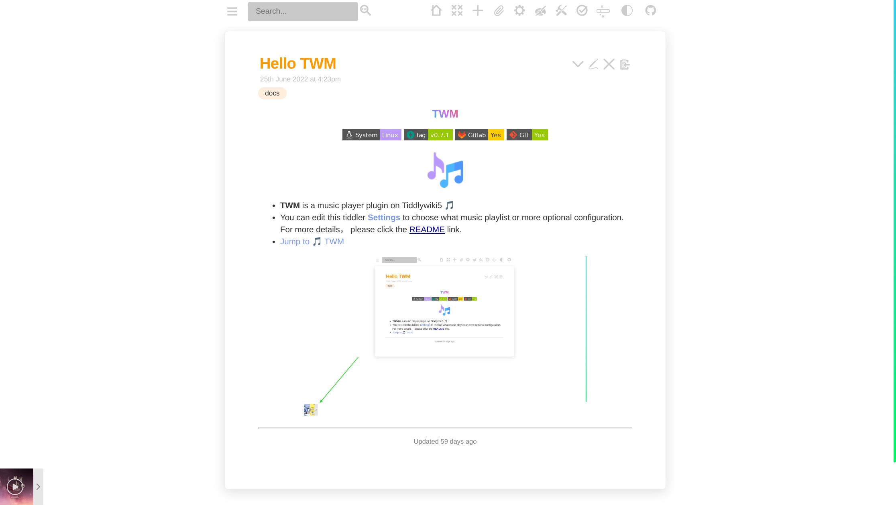

<h1 align="center">TWM</h1>

   • 
	<a href="https://oeyoews.github.io/twm">Home</a>
   • 

## Welcom to [TWM](https://twms.vercel.app/)

> Need reload your TiddlyWiki5 or reboot your application fter install this TWM plugin

## What's the TWM?

* A player in TiddlyWiki5

## Preview

 

# Usage

* Do nothing, just enjoy 🎵

## TODO

[TODO](docs/TODO.md)

##  FAQ

[FAQ](docs/FAQ.md)

## Related Link

* [MetingJS](https://github.com/metowolf/MetingJS)
* [Aplayer](https://github.com/DIYgod/APlayer)

## Status

* Self-use tools, welcome to submit issues. Perfecting...

## More

* more TiddlyWiki5 plugins are here: [Plugins](https://tw-cpl.netlify.app/#Index:Index)
